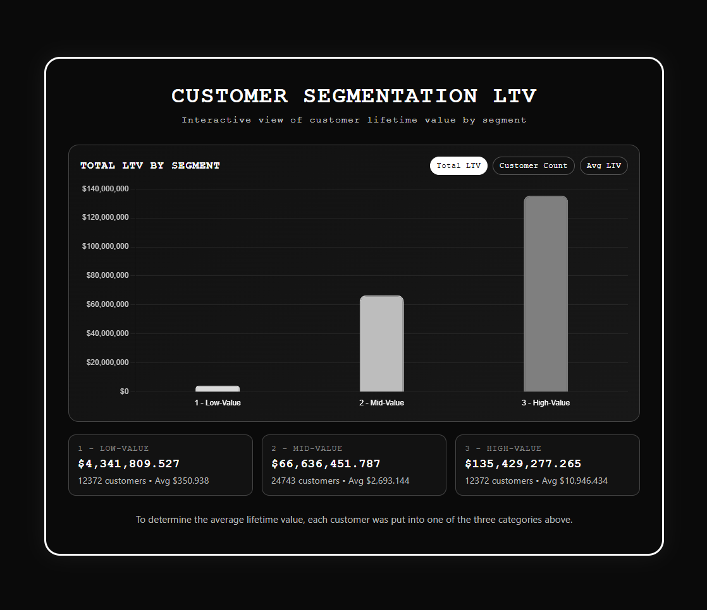
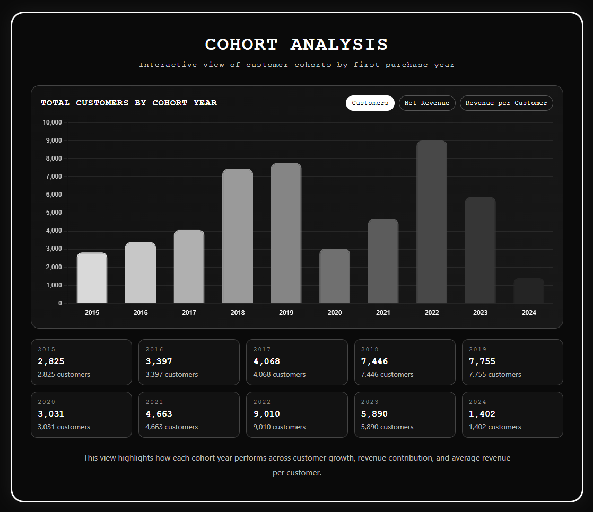
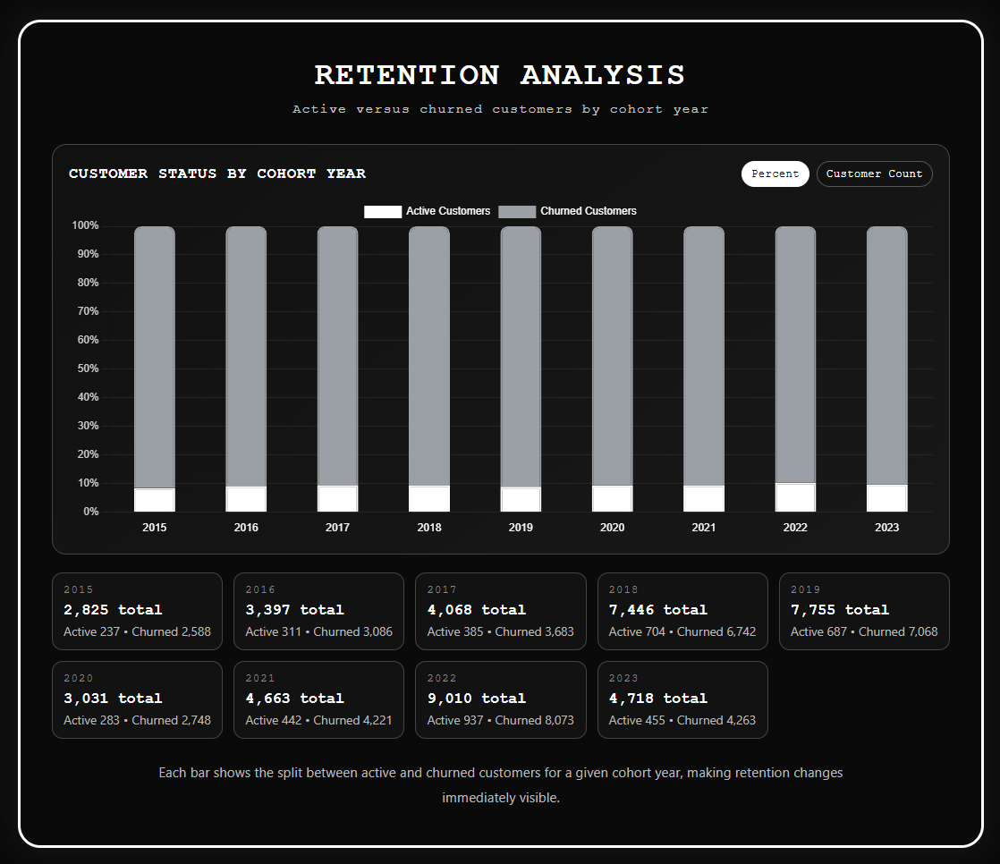

# 📊 Intermediate SQL - Sales Analysis

## 🎯 Overview
Analysis from the Contoso 2024 database examining customer behavior, retention, and value for the e-commerce company to raise customer retention and maximize customer revenue.

## 💼 Business Questions
1. **Customer Segmentation:** Who are our most valuable customers?
2. **Cohort Analysis:** How do different customer groups generate revenue?
3. **Retention Analysis:** Which customers haven't purchased recently?

## 🛠️ Analysis Approach

### 1. Customer Segmentation Analysis
- Categorized consumers based on their total lifetime value
- Customers were segmented into a Low-Value, Mid-Value, or High-Value category
- Determined the average lifetime value for each category of consumer

Query: [1_customer_segmentation.sql](sql/1_customer_segmentation.sql)

**Visualization:**

[View Interactive Chart...](charts/1_customer_segmentation.html)

**Key Findings**

- As expected, the high-value customers generate the most revenue, being almost double of the low and mid value customers combined.
- The customer count confirms a typical Pareto split; the high-value customers generate the most revenue by a mile despite their customer count being equal to the low-value group.
- The average lifetime value is again dominated by the high-value group. The low-value group value is insignificant in comparison despite the similar customer count.

**Business Insights**
- One-time buyers must be converted into spending more to close the gap, while an up-sell/cross-sell campaign targeted towards the mid-value group of customers can increase total revenue.
- It's important to remember that the low-value customer pool can include newly signed-up ones. Referral programs can increase the customer count and bring in customers that possibly resemble our high-value ones, considering people will invite others like themselves.
- To increase the average lifetime value for consumers as a whole, reminders, possible subscriptions, personalized ads/discounts are a must. Providing these methods when a consumer is at risk of churning is critical and will keep retention rates from raising.

### 2. Cohort Analysis
- Tracked revenue and customer count per cohorts
- Cohorts were grouped and sorted by the year of their first purchase
- Analyzed customer retention and behavior at a cohort level

Query: [2_cohort_analysis.sql](sql/2_cohort_analysis.sql)

**Visualization:**

[View Interactive Chart...](charts/2_cohort_analysis.html)

**Key Findings**

- The customer count, while having its highs, ends where it started - the bottom. A strong decline on both axes confirms a dwindling revenue per customer and customer count.
- As the year began, net revenue plummeted in 2020, crawling back up around 2022, showing a clear COVID-era acquisition shock to the market.
- First-order revenue quality per customer seems to slowly decline, peaking around 2016-2019 and falls every year since. Because these are determined by first-purchase, the loss in revenue is not a retention issue, but a possible pricing quality issue.

**Business Insights**
- Customer targeting must be tightened to bring new ones in and possibly make old customers return, as the customer count has hit an all-time low.
- The same applies for the total net revenue; first-order value must be increased with a different approach to acquisition.
- With the revenue per customer slowly falling, a cohort quality benchmark strategy could be prepared from the 2016-2019 period to track with new consumers.

### 3. Customer Retention
- Identified customers at risk of churning
- Analyzed their last purchase patterns
- Examined metrics unique to each customer

Query: [3_retention_analysis.sql](sql/3_retention_analysis.sql)

**Visualization:**

[View Interactive Chart...](charts/3_retention_analysis.html)

**Key Findings**

- The churn rate is noticeably flat, averaging around 90% across every year. This is unusual, as churn rates normally lessen or raise over years with different strategies, yet neither is the case from this data.
- The customer count rises and falls, doing well around 2018-2019, dipping, then peaking again in 2022. Despite these changes to the customer count, the churn rate doesn't budge.
- The main issue seems to be what's happening (or not happening) after the customers first purchase; only 1 in 10 customers seem to stay in the long run.

**Business Insights**
- The company's churn window must be validated, as this can vary depending on the type of business. It's important to keep in mind this query uses a 6-month churn window.
- Because of how stagnant the churn rate is, even a slight improvement would greatly increase our lifetime revenue.
- The failure point seems to be early within the cycle, so a second-purchase system (follow-up emails, second-purchase discount, etc.) after a few months can increase customer attention.

## 🚀 Strategic Recommendations

1. Customer Value Optimization (Customer Segmentation)
- Launch a targeted upsell/cross-sell campaign for the mid-value segment; It's the largest customer group and the clearest path to closing the gap with high-value customers.
- Consider a VIP program for high-value consumers; while they aren't the majority of customers, the group still provides the most revenue and are important to keep engaged.
- Build a referral program to bring in new customers who resemble existing high-value customers, since referrers tend to invite similar people.

2. Cohort Performance Strategy (Customer Revenue by Cohort)
- Tighten acquisition targeting to reverse the declining customer count trend, prioritizing channels that historically bring in higher first-order value.
- Re-evaluate first-order pricing and promotional strategy (e.g. discount depth), since falling revenue-per-customer ties back to a acquisition/pricing issue rather than retention.
- Use the 2016–2019 cohorts as a quality benchmark, tracking new cohorts against that period's customer count and revenue-per-customer to catch regressions early.

3. Retention & Churn Prevention (Customer Retention)
- Build a second-purchase program (timed follow-up emails, a second-purchase discount, replenishment reminders) targeting the first few months post-purchase, since that's the clear failure point.
- Introduce at-risk-of-churn triggers (personalized discounts, reminders, subscription options) to lift average lifetime value before low/mid-value customers disengage entirely.
- Treat churn reduction as the highest-leverage fix available; Because the rate is so stagnant, even a small improvement multiplies across every cohort simultaneously.

## ⚙️ Technical Details
- Database: PostgresSQL
- Analysis Tools: PostgresSQL, PGadmin, DBeaver
